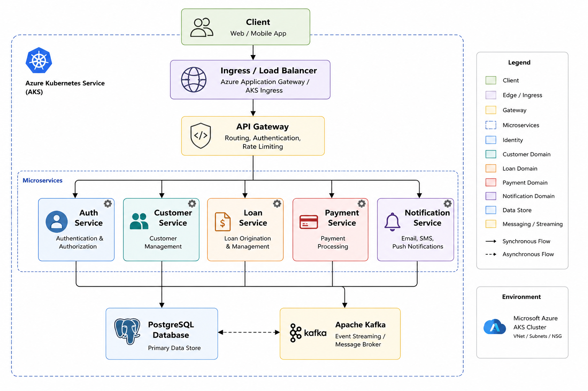

# 💸 CashMate Cloud-Native Loan Platform

> A production-ready, cloud-native microservices platform for digital loan management, built with Node.js, Docker, Kubernetes, Apache Kafka, and deployed across AWS EKS and Azure AKS.


---

## 📖 Overview

CashMate is a cloud-native loan management platform designed using microservices architecture principles. The platform demonstrates modern software engineering practices, including containerization, event-driven communication, Kubernetes orchestration, observability, and automated CI/CD pipelines.

The system is built to simulate production-grade financial applications by leveraging scalable microservices and multi-cloud deployment strategies.

---

## ✨ Features

* ✅ Microservices Architecture
* ✅ RESTful APIs
* ✅ Event-Driven Communication with Apache Kafka
* ✅ Containerized Services with Docker
* ✅ Kubernetes Deployments and Service Discovery
* ✅ Horizontal Pod Autoscaling (HPA)
* ✅ Rolling Updates and Zero-Downtime Deployments
* ✅ Multi-Cloud Deployment (AWS EKS & Azure AKS)
* ✅ CI/CD Pipelines with GitHub Actions
* ✅ Monitoring with Prometheus and Grafana
* ✅ Infrastructure as Code Ready
* ✅ Production-Ready Deployment Architecture

---

## 🏗️ System Architecture


---

## 🛠️ Technology Stack

| Category         | Technology          |
| ---------------- | ------------------- |
| Backend          | Node.js, Express.js |
| Database         | PostgreSQL          |
| Messaging        | Apache Kafka        |
| Containerization | Docker              |
| Orchestration    | Kubernetes          |
| Cloud Platforms  | AWS EKS, Azure AKS  |
| CI/CD            | GitHub Actions      |
| Monitoring       | Prometheus, Grafana |
| Version Control  | Git & GitHub        |

---

## 📂 Repository Structure

```text
cashmate-cloud-native-loan-platform/
├── .github/
│   └── workflows/
│       ├── ci.yml
│       ├── security-scan.yml
│       ├── deploy-k8s.yml
│       └── deploy-aks.yml
│
├── api-gateway/
├── customer-service/
├── loan-service/
├── credit-service/
├── disbursement-service/
├── payment-service/
├── notification-service/
│
├── frontend-web/
│
├── infrastructure/
│   ├── docker/
│   │   └── docker-compose.yml
│   │
│   ├── kafka/
│   │   ├── producer.js
│   │   ├── consumer.js
│   │   └── topics.md
│   │
│   └── k8s/
│       ├── base/
│       │   ├── namespace.yaml
│       │   ├── configmap.yaml
│       │   ├── secret.yaml
│       │   ├── ingress.yaml
│       │   ├── postgres.yaml
│       │   ├── kafka-deployment.yaml
│       │   ├── kafka-service.yaml
│       │   ├── kustomization.yaml
│       │   └── monitoring/
│       │       ├── prometheus.yaml
│       │       ├── grafana.yaml
│       │       └── dashboards/
│       │           └── cashmate-dashboard.json
│       │
│       ├── services/
│       │   ├── api-gateway.yaml
│       │   ├── api-gateway-hpa.yaml
│       │   ├── customer-service.yaml
│       │   ├── customer-service-hpa.yaml
│       │   ├── loan-service.yaml
│       │   ├── loan-service-hpa.yaml
│       │   ├── credit-service.yaml
│       │   ├── credit-service-hpa.yaml
│       │   ├── disbursement-service.yaml
│       │   ├── disbursement-service-hpa.yaml
│       │   ├── payment-service.yaml
│       │   ├── payment-service-hpa.yaml
│       │   ├── notification-service.yaml
│       │   ├── notification-service-hpa.yaml
│       │   └── kustomization.yaml
│       │
│       └── overlays/
│           ├── local/
│           │   └── kustomization.yaml
│           ├── aks/
│           │   └── kustomization.yaml
│           └── eks/
│               └── kustomization.yaml
│
├── docs/
│   ├── architecture.md
│   ├── api-endpoints.md
│   ├── kafka-events.md
│   ├── local-setup.md
│   ├── aks-deployment.md
│   └── screenshots/
│
├── README.md
├── .gitignore
└── package-lock files inside each service
```

---

## 🔧 Microservices

| Service              | Responsibility                               |
| -------------------- | -------------------------------------------- |
| API Gateway          | Central entry point and request routing      |
| Customer Service     | Customer registration and profile management |
| Loan Service         | Loan application and lifecycle management    |
| Credit Service       | Credit scoring and eligibility assessment    |
| Payment Service      | Loan repayment processing                    |
| Disbursement Service | Loan disbursement operations                 |
| Notification Service | Email and event notifications                |

---

## 📋 Prerequisites

Before running the project, ensure you have installed:

* Node.js (v20 or later)
* Docker
* Docker Compose
* Kubernetes (Minikube, Kind, or Docker Desktop Kubernetes)
* kubectl
* Git

---

## 🚀 Local Development

### Clone Repository

```bash
git clone https://github.com/nduka45/cashmate-cloud-native-loan-platform.git
cd cashmate-cloud-native-loan-platform
```

### Install Dependencies

```bash
npm install
```

### Start with Docker

```bash
docker compose up --build
```

---

## ☸️ Kubernetes Deployment

### Deploy to Kubernetes

```bash
kubectl apply -k infrastructure/k8s/overlays/dev
```

### Verify Deployments

```bash
kubectl get deployments -n cashmate
kubectl get pods -n cashmate
kubectl get svc -n cashmate
```

### Monitor Rollouts

```bash
kubectl rollout status deployment --all -n cashmate
```

---

## ☁️ Multi-Cloud Deployment

### Azure Kubernetes Service (AKS)

```bash
kubectl apply -k infrastructure/k8s/overlays/aks
```

### Amazon Elastic Kubernetes Service (EKS)

```bash
kubectl apply -k infrastructure/k8s/overlays/prod
```

---

## 🔄 CI/CD Pipeline

GitHub Actions automates the following workflow:

1. Checkout source code
2. Run application tests
3. Build Docker images
4. Push images to GitHub Container Registry (GHCR)
5. Deploy applications to Kubernetes clusters
6. Verify deployment rollouts
7. Perform rolling updates with zero downtime

---

## 📊 Monitoring and Observability

The platform includes:

* Prometheus for metrics collection
* Grafana dashboards for visualization
* Kubernetes readiness and liveness probes
* Horizontal Pod Autoscaling (HPA)
* Rolling updates and deployment monitoring

---

## 🎯 Learning Objectives

This project demonstrates practical experience with:

* Cloud-Native Application Development
* Microservices Architecture
* Kubernetes Administration
* Event-Driven Systems
* Multi-Cloud Deployment Strategies
* DevOps and CI/CD Automation
* Infrastructure as Code
* Production-Grade Container Orchestration

---

## 📸 Screenshots

Place architecture diagrams, Grafana dashboards, and AKS/EKS deployment screenshots in:

```text


```

---

## 👨‍💻 Author

**Sunday Nduka**

* GitHub: https://github.com/nduka45
* LinkedIn: https://linkedin.com/in/YOUR-LINKEDIN
* Email: [ndukasunday18@gmail.com](mailto:ndukasunday18@gmail.com)

---

## 📄 License

This project is licensed under the MIT License.


CashMate 💸
Cloud-Native Loan Management Platform

CashMate is a cloud-native, microservices-based loan management platform built to demonstrate modern software engineering, DevOps, and platform engineering practices.

The platform is containerized with Docker, orchestrated with Kubernetes, and deployed on both Amazon EKS (AWS) and Azure AKS (Microsoft Azure), showcasing:

Multi-cloud deployments
Kubernetes auto-scaling
Service discovery
Rolling updates and zero-downtime deployments
Load balancing
CI/CD automation
Observability and monitoring
Event-driven microservices architecture



Features
✅ Microservices Architecture
✅ RESTful APIs
✅ Event-Driven Communication with Apache Kafka
✅ Containerized Services with Docker
✅ Kubernetes Deployments and Service Discovery
✅ Horizontal Pod Autoscaling (HPA)
✅ Rolling Updates and Zero-Downtime Deployments
✅ Multi-Cloud Deployment (AWS EKS & Azure AKS)
✅ CI/CD Pipelines with GitHub Actions
✅ Monitoring with Prometheus and Grafana
✅ Infrastructure as Code Ready
✅ Production-Ready Deployment Architecture

🛠️ Technology Stack
Category	Technology
Backend	Node.js, Express.js
Database	PostgreSQL
Messaging	Apache Kafka
Containerization	Docker
Orchestration	Kubernetes
Cloud Platforms	AWS EKS, Azure AKS
CI/CD	GitHub Actions
Monitoring	Prometheus, Grafana
Version Control	Git & GitHub

Repository Structure
cashmate-cloud-native-loan-platform/
│
├── api-gateway/
├── auth-service/
├── customer-service/
├── loan-service/
├── payment-service/
├── notification-service/
│
├── infrastructure/
│   ├── docker/
│   ├── kubernetees
│   └── terraform/
│
├── docs/
│   ├── architecture/
│   └── screenshots/
│
├── .github/
│   └── workflows/
│
└── README.md

Prerequisites

Before running the project, ensure you have installed:

Node.js (v20 or later)
Docker & Docker Compose
Kubernetes (Minikube or Docker Desktop Kubernetes)
kubectl
Git

